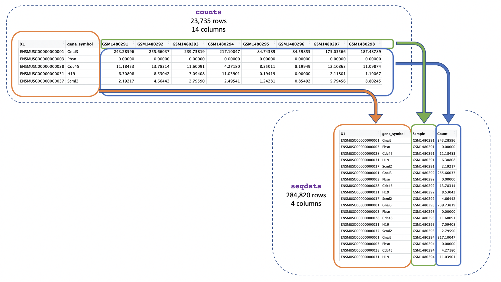

:::::::::::::::::::::::::::::::::::::: questions 

- What do the `pivot_longer()` and `full_join()` functions do?

::::::::::::::::::::::::::::::::::::::::::::::::

::::::::::::::::::::::::::::::::::::: objectives

- Explore how to convert data frames from wide to long format
- Join two data frames using column names

::::::::::::::::::::::::::::::::::::::::::::::::


## Converting from wide to long format

We will first convert the data from wide format into long format to make
it easier to work with and so that we can plot the data with the `ggplot2` package.

Instead of multiple columns with counts for each sample, we just want
one column containing all the expression values, as shown below:



We can use `pivot_longer()` to easily change the format into long
format.


::::::::::::::::::::::::::::::::::::: challenge

#### Your turn 3.1

Find out what `pivot_longer()` does and how to use it


``` r
?pivot_longer
```

:::::::::::::::::::::::::::::::::::::::::::::::::


::::::::::::::::::::::::::::::::::::: challenge

#### Your turn 3.2

Convert the counts data into long format and save it as a new object called `seqdata`


``` r
seqdata <- pivot_longer(counts, cols = starts_with("GSM"), 
                        names_to = "Sample", values_to = "Count")
```

We use `cols = starts_with("GSM")` to tell the function we want to reformat the columns whose names start with "GSM" (these columns are the ones where we have the gene counts).
`pivot_longer()` will then reformat the specified columns into two new columns, which 
we're naming "Sample" and "Count". 
The `names_to = "Sample"` specifies that we want the new column containing the columns to be named "Sample", and the `values_to = "Count"` specifies that we want the new column containing the values to be named "Count".

:::::::::::::::::::::::::::::::::::::::::::::::::

As explained earlier, in R there is often more than one way to do the same thing. We could
get the same result by specifying the argument `cols` in a different way. For example, 
instead of using `starts_with` we could use a range like the one you used in the previous section.


::::::::::::::::::::::::::::::::::::: challenge

#### Your turn 3.3

Convert the counts data into long format using a column range


``` r
seqdata <- pivot_longer(counts, cols = GSM1480291:GSM1480302, 
                        names_to = "Sample", values_to = "Count")
```

:::::::::::::::::::::::::::::::::::::::::::::::::

Another way we could do the same thing is by specifying the columns we *do not* want to reformat, this will tell `pivot_longer()` to reformat all the other columns. To do that 
we put **a minus sign "-"** in front of the column names that we don't want
to reformat. This is a pretty common way to use `pivot_longer()` as
sometimes it is easier to exclude columns we don't want than include
columns we do. The command below would give us the same result as the
previous command.

::::::::::::::::::::::::::::::::::::: challenge

#### Your turn 3.4

Convert the counts data into long format by specifying which columns not to convert


``` r
seqdata <- pivot_longer(counts, cols = -c("gene_id", "gene_symbol"), 
                        names_to = "Sample", values_to = "Count")
```

:::::::::::::::::::::::::::::::::::::::::::::::::


::::::::::::::::::::::::::::::::::::: challenge

#### Your turn 3.5

Type each command line above, then look at the data, are all three of the `seqdata` objects you made the same?

:::::::::::::::: solution

All three `seqdata` objects are the same, as we did the same conversion from wide to long format using 3 different methods. `seqdata` has 284820 rows and 4 columns, and has length 4. 

:::::::::::::::::::::::::

:::::::::::::::::::::::::::::::::::::::::::::::::


## Joining two tables

Now that we've got just one column containing sample IDs in both our
counts and metadata objects we can join them together using the sample
IDs. This will make it easier to identify the categories for each sample
(e.g. if it's basal cell type) and to use that information in our plots.


We use the function `full_join()` and give as arguments
the two tables we want to join. We add
`by = join_by(Sample == sample_id)` to say we want to join on the column
called "Sample" in the first table (`seqdata`) and the column called
"sample_id" in the second table (`sampleinfo`) when the values match:


::::::::::::::::::::::::::::::::::::: challenge

#### Your turn 3.6

Join the count data and metadata by matching sample IDs


``` r
allinfo <- full_join(seqdata, sampleinfo, by = join_by(Sample == sample_id))
```

:::::::::::::::::::::::::::::::::::::::::::::::::


::::::::::::::::::::::::::::::::::::: challenge

#### Your turn 3.7

Have a look at the new object you generated above and see what information it includes, how many columns does it have and what does each column tell you?

:::::::::::::::: solution


``` r
dim(allinfo)
```

``` output
[1] 284820      7
```

``` r
colnames(allinfo)
```

``` output
[1] "gene_id"             "gene_symbol"         "Sample"             
[4] "Count"               "characteristics"     "immunophenotype"    
[7] "developmental stage"
```

The `allinfo` object has 7 columns which tell you about the gene id and symbol, the same id, gene count, and sample information (characteristics, immunophenotype, and developmental stage). 

::::::::::::::::::::::::::

:::::::::::::::::::::::::::::::::::::::::::::::::

::::::::::::::::::::::::::::::::::::: keypoints 

- The `pivot_longer()` function can convert data frames from wide to long format and there are multiple ways to do this
- The `full_join()` function can merge two data frames. You can specify which column names should be joined by using the `join_by()` function.

::::::::::::::::::::::::::::::::::::::::::::::::

